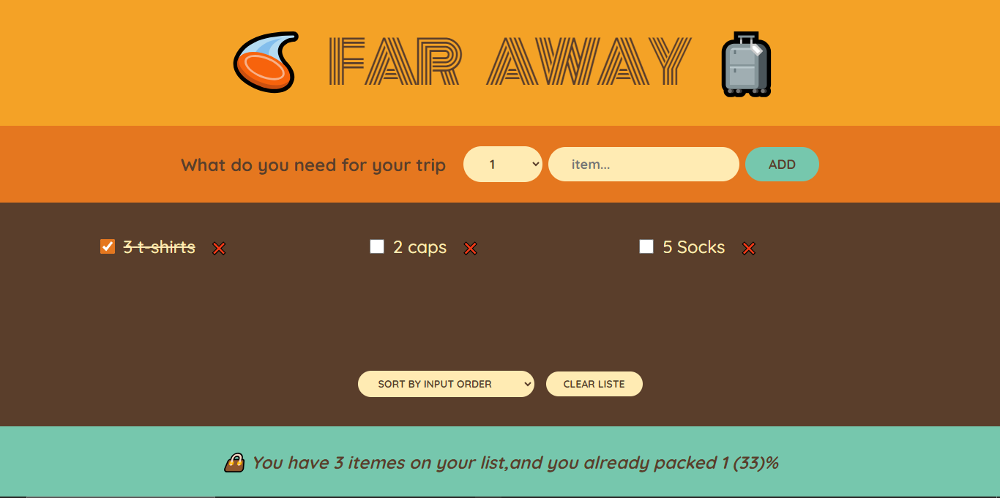

By building this travel list application in React, I learned how to manage state, handle form inputs, dynamically render lists, and implement functionalities such as adding, deleting, sorting items, and clearing the list.

